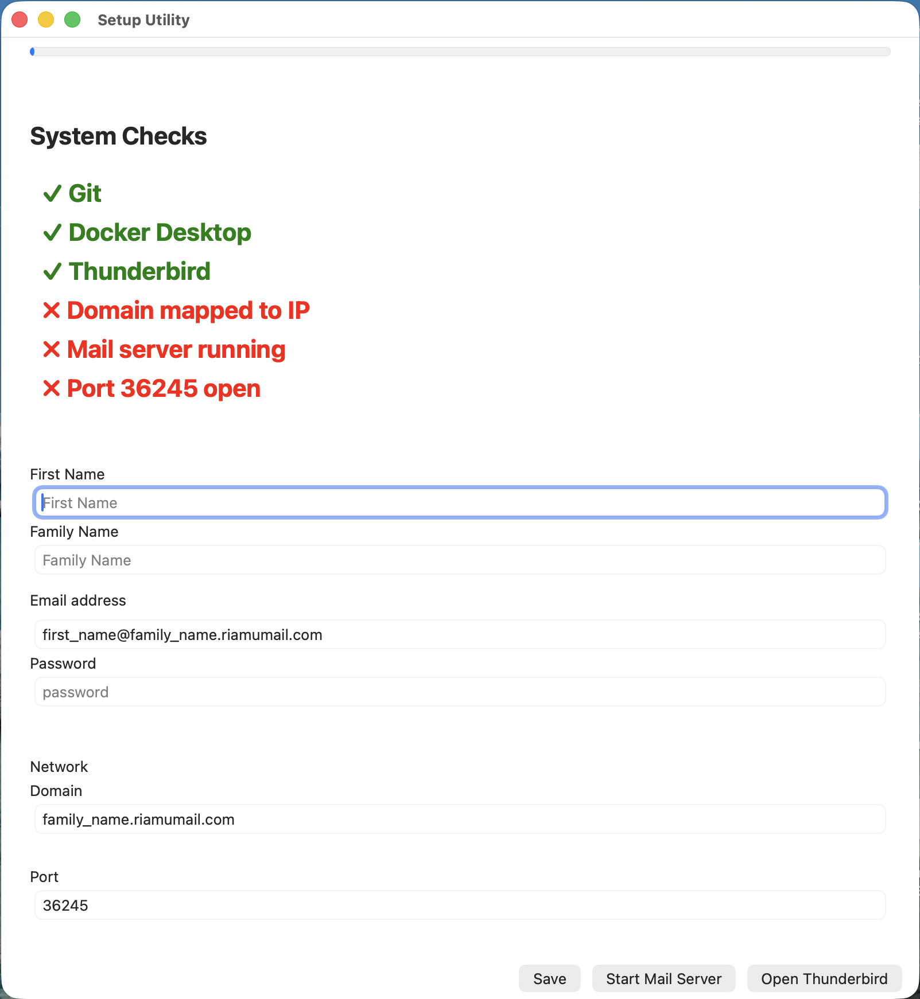

# Riamu Mail App

This app lets your setup your self-hosted mail yourself for free or buy a pro plan that Riamu Technologies inc. will set up for you. Enterprise plans and support is available!

Riamu Mail is part of a mail experiment. Checkout https://github.com/umrashrf/mailexp



## Troubleshoot

Log file is located at ~/.riamumail/app.log on Linux and Mac.

And for Windows it should be at C:\Users\your_name\\.riamumail\app.log

## Test

Send an email to umair@ashraf.riamumail.com for testing. And, I, a real human will respond.

## Mobile

Use this Android App to login to your IMAP and SMTP servers https://play.google.com/store/apps/details?id=com.emclient.mailclient&pcampaignid=web_share

### IMAP

```
Host: 192.168.4.42
Port: 10143

Username: your_username (not your email)
Password: your_password

Authentication: Password plain

SSL/TLS: None
```

### SMTP

```
Host: 192.168.4.42
Port: 36245

Username: your_username (not your email)
Password: your_password

Authentication: Password plain

SSL/TLS: None
```

Note: eM Client app does not ask for port number during setup screen, after setup, you have to go into settings, click the account you just added and then click IMAP and SMTP at the bottom to change the port.
